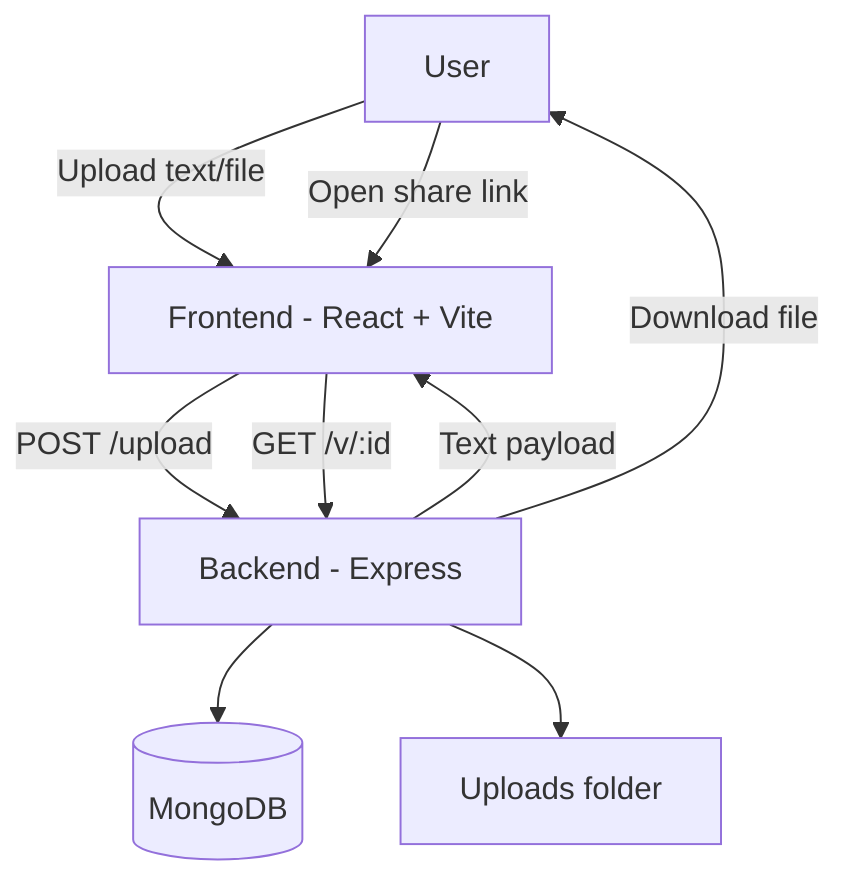

## LinkVault Data Flow

```mermaid
flowchart TD
  A[User] -->|Upload text/file| B[Frontend - React + Vite]
  B -->|POST /upload| C[Backend - Express]
  C --> D[(MongoDB)]
  C --> E[Uploads folder]
  A -->|Open share link| B
  B -->|GET /v/:id| C
  C -->|Text payload| B
  C -->|Download file| A
```
